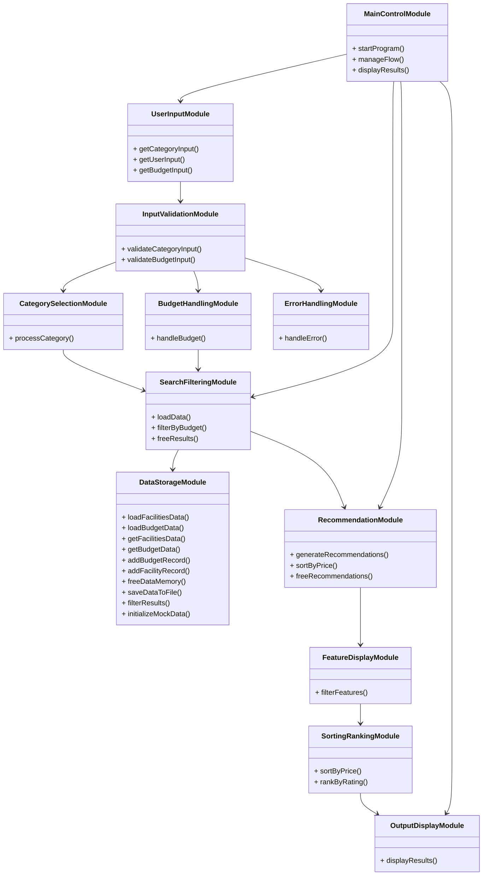

```mermaid

classDiagram

class MainControlModule{
+ startProgram()
+ manageFlow()
+ displayResults()
}

class UserInputModule{
  + getCategoryInput()
  + getUserInput()
  + getBudgetInput()
}

class InputValidationModule{
  + validateCategoryInput()
  + validateBudgetInput()
}

class CategorySelectionModule{
  + processCategory()
}

class BudgetHandlingModule{
  + handleBudget()
}

class SearchFilteringModule{
  + loadData()
  + filterByBudget()
  + freeResults()
}

class RecommendationModule{
  + generateRecommendations()
  + sortByPrice()
  + freeRecommendations()
}

class DataStorageModule{
  + loadFacilitiesData() 
  + loadBudgetData()
  + getFacilitiesData()
  + getBudgetData()
  + addBudgetRecord()
  + addFacilityRecord()
  + freeDataMemory()
  + saveDataToFile()
  + filterResults()
  + initializeMockData()
}

class FeatureDisplayModule{
  + filterFeatures()
}

class SortingRankingModule{
  + sortByPrice()
  + rankByRating()
}

class OutputDisplayModule{
  + displayResults()
}

class ErrorHandlingModule{
  + handleError()
}

%% Connections

MainControlModule --> UserInputModule
MainControlModule --> SearchFilteringModule
MainControlModule --> RecommendationModule
MainControlModule --> OutputDisplayModule

UserInputModule --> InputValidationModule

InputValidationModule --> CategorySelectionModule
InputValidationModule --> BudgetHandlingModule
InputValidationModule --> ErrorHandlingModule

CategorySelectionModule --> SearchFilteringModule
BudgetHandlingModule --> SearchFilteringModule

SearchFilteringModule --> DataStorageModule
SearchFilteringModule --> RecommendationModule

RecommendationModule --> FeatureDisplayModule

FeatureDisplayModule --> SortingRankingModule

SortingRankingModule --> OutputDisplayModule


```
